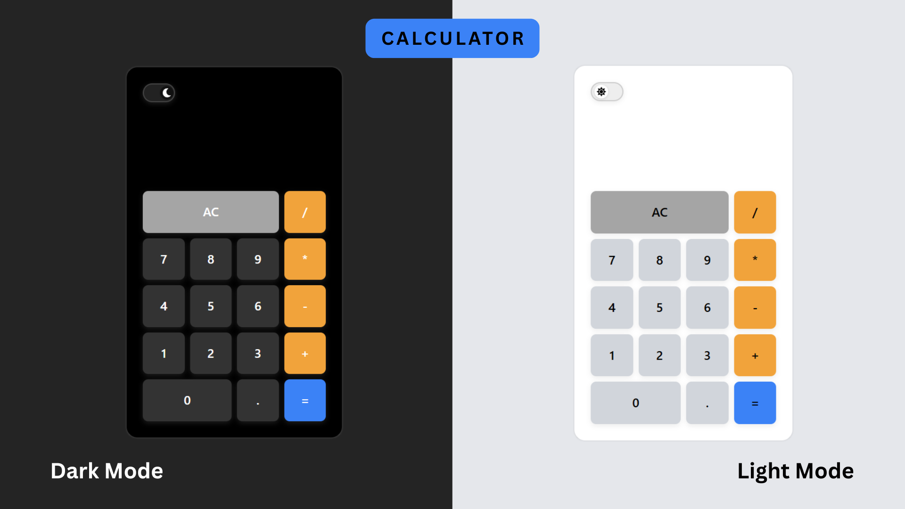

# Calculator with Audit Logging



## Overview

A lightweight calculator application built with the **MERN stack** (MongoDB, Express.js, React, Node.js) that performs basic arithmetic operations and captures detailed audit logs of all user interactions. These logs are sent to a backend server and stored for later analysis and review.

## Live Demo

- **Frontend**: [Calculator App](https://calculator-audit-fullstack.vercel.app)
- **Backend**: [API Host](https://calculator-audit-fullstack.onrender.com)

## ✨ Current Features

- **Basic Operations**: Perform addition, subtraction, multiplication, and division
- **Real-Time UI**: React-based interactive interface
- **Audit Logging**: All calculator actions (e.g., number press, operations) are logged
- **View Logs**: Fetch and review audit trails using the API
- **Responsive Design**: Optimized for both desktop and mobile

## 🛠️ Tech Stack

### Frontend

- **Framework**: React
- **Styling**: CSS, TailwindCSS
- **Build Tool**: Vite
- **Deployment**: Vercel

### Backend

- **Runtime**: Node.js
- **Framework**: Express.js
- **Database**: MongoDB
- **Deployment**: Render

## 📂 Project Structure

```
CALCULATOR-AUDIT-APP/
│
├── backend/                # Node.js & Express backend
│   ├── config/             # Configuration files
│   ├── database/           # Database connection
│   ├── errors/             # Error handlers
│   ├── controllers/        # Request handlers
│   ├── models/             # Mongoose schemas
│   ├── routes/             # API routes
│   ├── services/           # Business logic
│   ├── repositories/       # DB communication logic
│   ├── .env                # Environment variables
│   └── index.js            # Entry point
│
├── frontend/               # React frontend
│   ├── src/
│   │   ├── components/     # Calculator UI components
│   │   ├── pages/          # App layout
│   │   ├── theme/          # Theming
│   │   ├── ui/             # Reusable base components
│   │   ├── store/          # Reducer and actions
│   │   ├── services/       # API integration
│   │   ├── utils/          # Utilities
│   │   ├── App.jsx         # Root component
│   │   └── main.jsx        # Entry point
│   ├── .env                # Environment variables
│   └── vite.config.js      # Vite configuration
│
└── README.md               # Project documentation
```

## 🚀 Getting Started

### Prerequisites

- Node.js (v18 or later)
- MongoDB (local or Atlas)
- Git

### Installation

1. **Clone the repository**

   ```bash
   git clone https://github.com/reverensky/calculator-audit-fullstack.git
   cd calculator-audit-fullstack
   ```

2. **Backend Setup**

   ```bash
   cd backend
   npm install
   ```

   Create a `.env` file:

   ```
   DB_URI=mongodb+srv://<user>:<password>@cluster-url/db-name
   PORT=3000
   ```

3. **Frontend Setup**

   ```bash
   cd ../frontend
   npm install
   ```

   Create a `.env` file:

   ```
   VITE_BASE_URL=http://localhost:3000
   ```

### Running the Application

1. **Start the backend server**

   ```bash
   cd backend
   npm run dev
   ```

2. **Start the frontend dev server**

   ```bash
   cd frontend
   npm run dev
   ```

3. **Access the App**

   Open your browser and navigate to:
   `http://localhost:5173`

# API Documentation

## Endpoints

| Method | Endpoint      | Description                           |
| ------ | ------------- | ------------------------------------- |
| POST   | `/api/events` | Log a calculator interaction event    |
| GET    | `/api/events` | Retrieve event logs (with pagination) |

## ✅ Log an Event

```bash
curl --location --request POST 'https://calculator-audit-fullstack.onrender.com/api/events?action=numberEntered&value=0&session_id=4b670d3d-d14c-429d-8659-e55071bff967' \
```

**Parameters**:

- `action` (string): e.g., `numberEntered`, `operationClicked`, `resultCalculated`
- `value` (string/number): The value or operand involved
- `session_id` (string): UUID to identify a session

## 🔍 Fetch Logs

```bash
curl --location 'https://calculator-audit-fullstack.onrender.com/api/events?offset=0&limit=5&session_id=4b670d3d-d14c-429d-8659-e55071bff967'
```

**Query Parameters**:

| Parameter    | Description                |
| ------------ | -------------------------- |
| `offset`     | Number of logs to skip     |
| `limit`      | Number of logs to retrieve |
| `session_id` | Unique session ID          |

## 📦 Event Log Schema

Each event record includes:

- `_id`: Unique log ID
- `action`: User action (e.g., "numberEntered")
- `value`: Input value (e.g., 7, "+")
- `timestamp`: ISO date of when the event occurred

## 🧠 Design Considerations

- **Decoupled Audit Logging**: All events are POSTed to the backend independently of UI calculations
- **Scalable Schema**: MongoDB schema supports rapid insertions and flexible querying
- **Separation of Concerns**: Clear separation between UI, logic, and storage
- **Pagination**: Logs can be paginated via `offset` and `limit` parameters

## 📝 Project Summary

The Audit-Logging Calculator is a simple yet powerful demonstration of combining frontend UI with backend observability. It tracks every user interaction, logs it to a database, and allows for robust audit trail retrieval. The project is structured to support scaling, enhanced features, and integration into more complex systems.

## 📞 Contact

- **Email**: [sreevatsavpuligattu@gmail.com](mailto:sreevatsavpuligattu@gmail.com)
- **GitHub**: [reverensky](https://github.com/reverensky)
